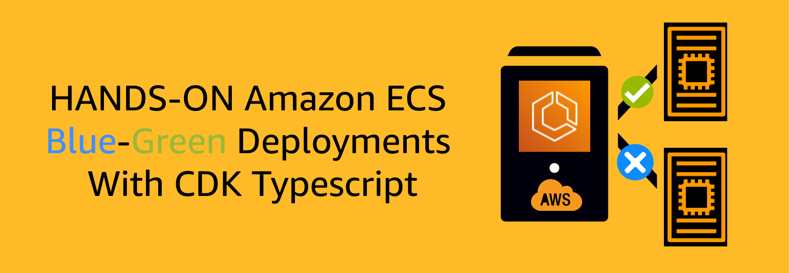

<p align="center">
  <a href="https://dev.to/vumdao">
    
  </a>
</p>
<h1 align="center">
  <div><b>Hands-on Amazon ECS for Blue-Green Deployments With CDK Typescript</b></div>
</h1>

## Abstract
- This blog post supports you to hands-on AWS ECS by building the Blue-Green Deployments With CDK Typescript. Instead of using AWS console to create all necessary resources, you will create them through CDK code and automate deploy with CDK pipeline for both project application and infrastructure as code.

## Table Of Contents
 * [Solution overview](#Solution-overview)
 * [Source code structure](#Source-code-structure)
 * [Process flow](#Process-flow)
 * [Cleanup](#Cleanup)
 * [Conclusion](#Conclusion)

---

## 🚀 **Solution overview** <a name="Solution overview"></a>


- The whole AWS resources are created using CDK pipleine except the pipeline itself.
- The ECS cluster is placed in private subnet with EC2 instances which is managed by the autoscaling group. We create two services which are Blue and Green, there should be only one service has desire count > 0 and the other is 0 at the time so that the application load balancer always forwards the request to one of them.
- Container image is built with codepipeline and codebuild which store images to ECR.

## 🚀 **Source code structure** <a name="Source-code-structure"></a>
- We have two Git repositories (codecommit) one for application project `app-project` directory and other for CDK infrastructure `cdk-infra` directory

  ```
  ➜  ecs-blue-green-deployments tree -L 1
  .
  ├── README.md
  ├── app-project
  ├── cdk-infra
  └── images

  3 directories, 1 file
  ```

- We create the codecommit repositories through CDK
  - Go to `cdk-infra` and run `cdk ls`
    ```
    cdk ls
    simflexcloud-ecs-blue-green-deployments-pipeline
    simflexcloud-ecs-blue-green-deployments-pipeline/master-sin/EcsBlueGreenDeploymentsStack
    simflexcloud-ecs-blue-green-deployments-pipeline/master-sin/simflexcloud-ecs-blue-green-deployments-build-image
    ```

  - Deploy `simflexcloud-ecs-blue-green-deployments-pipeline` it will create the repository of `cdk-infra`. Note: replace `CDK_DEFAULT_ACCOUNT` and `CDK_DEFAULT_REGION` in `cdk-infra/src/shared/constants.ts` with expected ones.
    ```
    cdk deploy simflexcloud-ecs-blue-green-deployments-pipeline
    ```

  - Add the remote Git repository to `cdk-infra` (Note: Replace the `priv-acc` with yours)
    ```
    git remote add origin ssh://priv-acc/v1/repos/ecs-blue-green-deployments-infra
    ```

  - Create branch `master` and push source code to the repo, it will trigger CDK pipeline to create all stacks which also include the repository and pipeline for `app-proj`

  - After the pipeline completed successfully, go to `app-proj` directory and add Git remote repository, then create the branches `testgreen` and `testblue` and push them to codecommit
    ```
    git remote add origin ssh://priv-acc/v1/repos/simflexcloud-ecs-blue-green-deployments
    ```

## 🚀 **Process flow** <a name="Process-flow"></a>
**1. Build project**
  - Use AWS CodeBuild to create Docker images and store them in Amazon ECR. This process is powered by codepipeline to handle CICD. We need to build two image tags which are `testgreen` based on branch `testgreen` and `testblue` based on branch `testblue`. Any commits from these branches will trigger pipelines to execute build projects based on the `buildspec.yml` and `Dockerfile`.

    

    

    

**2. Create ECS cluster**
  - Create an Amazon ECS cluster using EC2 as container instance. The EC2 instance is attached an IAM role which includes `AmazonEC2ContainerServiceforEC2Role` policy for the ECS agent to connect to ECS cluster.

    

  - Task definitions are required to run Docker containers in Amazon ECS. They tell the services which Docker images to use for the container instances, what kind of resources to allocate, network specifics, and other details. We create two task definitions which are Blue and Green. In the task, we define image tag, task size, container port, Task execution role, etc.

    

  - With ECS, we can easily deploy and manage containerized applications at scale, while benefiting from features such as automatic scaling, load balancing, and automatic service discovery. It resembles Auto Scaling in that it keeps a specified number of instances, but unlike Auto Scaling, it doesn't adjust the number of instances in response to CloudWatch alarms or other Auto Scaling mechanisms. By utilizing a load balancer, it is possible to maintain a specified amount of resources while ensuring a singular application reference point. As such, we generate two distinct services, one for the blue application and the other for the green application. Only one service is active (has desire count greater than zero) at a time.

    

    

  - Due to desired tasks 2, the service creates 2 containers on the EC2 instance and expose the public port for ALB target group, mapping to container port 8081.

    

**3. Test the blue green deployments**
  - Test the blue service by calling the `/api` request with ALB DNS

    

  - Now we switch deployment to green service by updating `desiredCount` from `blue` to 0 and from `green` to 2 then deploy.

    

  - We see targetgroup add new target port and draining the old one

    

    

## 🚀 **Cleanup** <a name="Cleanup"></a>
- To cleanup all resoures in this project, we first need to delete the ECR image as they were not created by CDK and prevent CDK to destroy the ECR repository.
- Go to cloudformation and delete stacks.

  

## 🚀 **Conclusion** <a name="Conclusion"></a>
- Now that you know how to launch tasks into your Amazon ECS cluster using CDK pipeline
- The approach of a blue-green deployment involves utilizing two identical production environments as a means of reducing downtime. Various cutover strategies may be employed, but typically only one of the environments should be actively serving production traffic.

---
<h3 align="center">
  <a href="https://dev.to/vumdao">:stars: Blog</a>
  <span> · </span>
  <a href="https://github.com/vumdao/ecs-blue-green-deployments">Github</a>
  <span> · </span>
  <a href="https://stackoverflow.com/users/11430272/vumdao">stackoverflow</a>
  <span> · </span>
  <a href="https://www.linkedin.com/in/vu-dao-9280ab43/">Linkedin</a>
  <span> · </span>
  <a href="https://www.linkedin.com/groups/12488649/">Group</a>
  <span> · </span>
  <a href="https://www.facebook.com/CloudOpz-104917804863956">Page</a>
  <span> · </span>
  <a href="https://twitter.com/VuDao81124667">Twitter :stars:</a>
</h3>